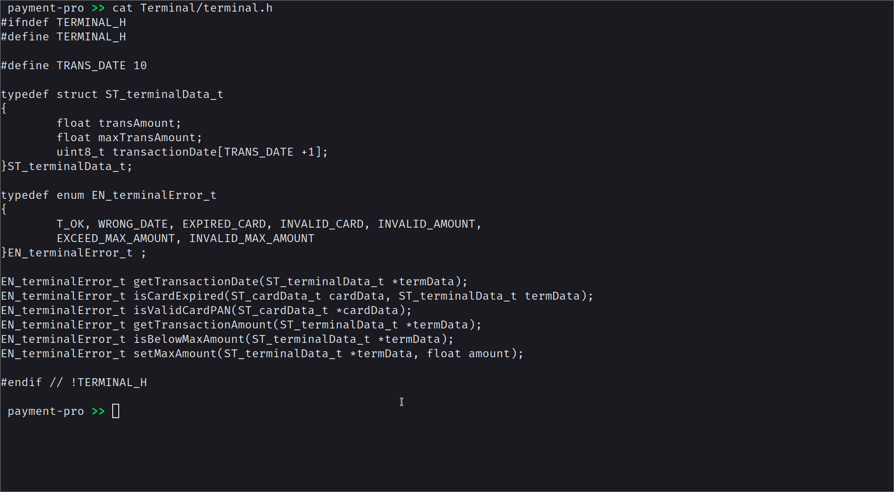

# Dependencies
Using the gnu (gcc (GCC) 12.1.0)

Using cmake version 3.23.2

---

# Notes
- Database:
	- the db consists of 2 .txt files "Transactions DB.txt" and "Accounts DB.txt" written in the format -> "prop1:prop2:prop3...".

- Terminal module:
	- default max transaction amount is 5000.
	- transaction date is automatically inferred from system.

- Server module:
	- account and transaction DB are not implemented as mentioned in the rubric, an external DB was made instead.


---

## Install and Run instructions

```
	# clone project
	git clone https://github.com/yarob-0/payment-pro.git
	cd payment-pro

	# build
	mkdir build
	cd build
	cmake ../
	make

	#run
	./payment
```

---

# File contents

## file tree


## app.h


## card.h


## terminal.h


## server.h


## util.h


## accounts-db.png


## transactions-db.png


---

# TESTS

## test-1.png


## test-2.png


## test-3.png


## test-4.png


## test-5.png


## test-6.png


